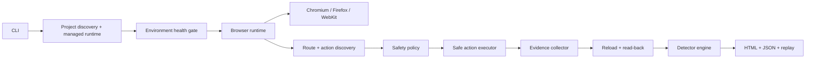

<p align="center">
  
</p>

<p align="center">
  <strong>Runtime behavioral verification for AI-built web applications.</strong><br>
  RealDone clicks the visible action, observes what actually happens, reloads the page, and reports evidence — not vibes.
</p>

<p align="center">
  <a href="https://github.com/datzle123/RealDone/actions/workflows/ci.yml"></a>
  <a href="LICENSE"></a>
  <a href="https://nodejs.org"></a>
</p>

---

AI coding agents are very good at making a feature *look* finished: the button clicks, a spinner appears, a success toast fires, and a new row shows up. None of those things prove the feature exists beyond the current browser state.

RealDone runs your application in a real browser and builds an evidence chain. Quick scans default to Chromium; recorded contracts can also be release-gated in Firefox and WebKit:

```text
Visible action
→ Real browser execution
→ Network / console / DOM / storage evidence
→ Reload and read-back
→ Evidence-backed verdict
→ Reproducible finding
```

## Product truth and current status

The normative [`Full Product Functional and Quality Specification`](docs/PRODUCT_SPECIFICATION.md) defines the complete RealDone scope and release bar for maintainers, contributors, and coding agents. The evidence-based [`product status`](docs/PRODUCT_STATUS.md) records what is implemented, partial, or planned. RealDone already ships useful, tested releases, but it is **not yet complete against the full-product definition in specification §32**.

## Five-minute start

```bash
git clone https://github.com/datzle123/RealDone.git
cd RealDone
corepack enable
pnpm install
pnpm exec playwright install chromium
pnpm build

node dist/cli.js scan http://localhost:3000
```

RealDone can also discover and own the target lifecycle instead of requiring a second terminal:

```bash
node dist/cli.js init ../my-app
node dist/cli.js scan --project ../my-app --manage-runtime
```

The managed form detects the framework, package manager, commands, port, database/auth hints, starts the app, waits for health, captures redacted logs, restarts a bounded crash, scans, and stops the process.

Or point RealDone at an installed Chrome/Chromium:

```bash
node dist/cli.js scan http://localhost:3000 --browser-path "/path/to/chrome"
```

The result is written locally to `.realdone/reports/<scan-id>/report.html` plus machine-readable JSON, one replay contract per finding, and dedicated network, snapshot, console, WebSocket, upload, and download evidence directories.

<p align="center"></p>

## What a finding looks like

```text
RD-014 · Save settings

00.00s  Opened /settings
00.82s  Filled display name: RD_TEST_8F21C4
01.03s  UI success: Saved successfully
01.03s  Write requests observed: none
02.11s  Reloaded; canary present: false

Verdict: CONTRADICTORY
Detector: RD301 — Success before proof

Reason:
The interface reported success without an observed write request.

Replay:
realdone replay RD-014 --report-dir .realdone/reports/<scan-id>
```

## Verdicts

| Verdict | Meaning |
| --- | --- |
| `VERIFIED` | Observed evidence supports the action at the reported evidence level. |
| `CONTRADICTORY` | The UI claimed success while runtime evidence disagreed. |
| `EPHEMERAL` | The result existed in the current DOM/runtime and disappeared after reload. |
| `BROWSER_LOCAL` | Persistence is limited to one browser context. |
| `BROKEN` | A request, page, console, navigation, or execution error occurred. |
| `NO_EFFECT` | No DOM, URL, network, storage, dialog, or download effect was observed. |
| `UNCERTAIN` | Something happened, but the available evidence cannot prove the intended behavior. |
| `SKIPPED` | Safety policy, credentials, scan budget, or unsupported input prevented execution. |
| `EXPECTED_CHANGE` | A versioned behavior contract changed and the new behavior passes. |
| `REGRESSION` | Previously passing behavior unexpectedly fails or disappears. |

Environment validity is reported separately as `VALID`, `ENVIRONMENT_INVALID`, or `BLOCKED`. RD1001–RD1005 findings never enter application-defect precision/recall.

## Phase 1 detectors

- `RD001` broken action
- `RD002` no observable effect
- `RD003` duplicate submission
- `RD004` stuck loading
- `RD005` broken navigation
- `RD006` disabled-after-click failure
- `RD007` keyboard action missed
- `RD008` action discovery/recording boundary
- `RD101` refresh disappearance
- `RD102` browser-local persistence
- `RD103` new-session disappearance
- `RD104` memory-only state
- `RD105` app-restart disappearance
- `RD201` fake create
- `RD202` fake update
- `RD203` fake delete
- `RD204` partial update
- `RD205` wrong-resource update
- `RD301` success before proof
- `RD302` success despite failure
- `RD303` silent failure
- `RD304` false success redirect
- `RD305` hard-coded success endpoint
- `RD1001` invalid static root
- `RD1002` critical asset missing
- `RD1003` bootstrap failure
- `RD1004` invalid test-data environment
- `RD1005` misconfigured auth state

RealDone deliberately prefers a small number of reproducible findings over a large number of guesses.

The complete catalog also includes RD401–RD405 mock/demo behavior, RD501–RD505 authentication, RD601–RD605 authorization, RD701–RD705 file/export, RD801–RD805 payment/provider integrity, RD901–RD905 regression, and RD1001–RD1005 environment validity. [`PRODUCT_SPECIFICATION.md`](docs/PRODUCT_SPECIFICATION.md) defines each detector; every implemented detector is release-gated by observable broken/control evidence.

## CLI

```text
realdone init [project-directory]

realdone scan [url]
  --max-pages <n>          discovery budget (default 8)
  --max-actions <n>        execution budget (default 24)
  --storage-state <file>   authenticated Playwright state
  --headed                 show Chromium
  --allow-host <hostname>  allow mutation on explicit staging
  --allow-destructive      opt in to destructive actions
  --allow-external         opt in to external effects
  --browser-path <file>    existing Chrome/Chromium executable
  --project <directory>    discover project/runtime configuration
  --manage-runtime         start, health-check, and stop the target app
  --runtime-mode <mode>    development, production, or docker
  --runtime-restarts <n>   bounded target crash restarts
  --health-endpoint <path> explicit app health endpoint
  --environment-timeout   asset/bootstrap/render health budget
  --accept-environment-risk continue after acknowledging an invalid environment
  --allow-iframe          opt in to same-origin iframe actions
  --policy <file>          rules, overrides, hosts, and budgets
  --deep                   confirm mutations in a fresh browser context
  --trace                  capture a Playwright trace per executed action
  --video                  capture browser video per executed action
  --max-duration <ms>      global time budget
  --retries <n>            transient navigation/locator retries

realdone replay <finding-id> [--report-dir <scan-directory>]
realdone cleanup --report-dir <scan-directory> [--confirm --confirm-database]
realdone benchmark <url> --expected <expectations.json> [--verify-replays]
realdone record <url> --name "Create customer"
realdone verify .realdone/flows/create-customer.json
realdone verify .realdone/flows/create-customer.json --deep
realdone verify .realdone/flows/create-customer.json --postgres-config .realdone/postgres.json
realdone verify .realdone/flows/create-customer.json --sqlite ./data/application.sqlite
realdone verify .realdone/flows/create-customer.json --database-config .realdone/supabase.json
realdone verify .realdone/flows/create-customer.json --provider-config .realdone/providers.json
realdone matrix .realdone/flows/create-customer.json
realdone baseline .realdone/flows --out .realdone/baseline.json
realdone ci --baseline .realdone/baseline.json --contracts .realdone/flows
realdone export-playwright <contract.json> --out tests/flow.spec.ts
realdone run codex --task-file task.md --contracts .realdone/flows
```

Recorded verification supports `--browser`, repeated `--role-state role=file`, zero-config `--sqlite file`, repeated `--database-config file`, repeated `--provider-config file`, repeated `--plugin manifest.json`, and `--performance-budget budget.json`. Advanced features stay opt-in, so the default scan remains one Chromium worker with no database, provider, plugin, extra-role, or AI dependency.

## Safe by default

Full verification is enabled automatically only for `localhost`, `127.0.0.1`, `.test`, and `.local`. Other hosts are discovery-only unless explicitly allowlisted. Payment, email, SMS, invite, upload/export, refund, account deletion, and similar effects are blocked unless the matching opt-in flag is supplied. Cross-origin navigation links are also skipped unless `--allow-external` is explicit.

Reports never store authorization headers, cookie values, password values, tokens, API keys, or database URLs. Storage is represented by key names and short hashes.

## Architecture



The core is deterministic and has no AI, database, cloud, framework, or coding-agent dependency. See [Architecture](docs/ARCHITECTURE.md) for contracts and extension points.

## Reliability controls

Actions are replayed through weighted semantic fingerprints: test ID, accessible role/name and label, stable ID, href, visible text, and CSS fallback. DOM ordinal is retained only as diagnostic metadata and is never used to substitute a missing target. Every attempt records match count, visible count, weight, timing, selected strategy, and bounded retries.

Use a checked-in policy when a project needs explicit classification or budget controls:

```bash
node dist/cli.js scan http://localhost:3000 --policy examples/realdone.policy.json
```

Mutations that expose a resource ID or `Location` header are added to `cleanup-ledger.json`. Cleanup is a dry run unless `--confirm` is supplied, accepts `404` as already-cleaned, and reuses optional Playwright auth state without copying secrets into the ledger.

## Record once, verify deterministically

For multi-step or authenticated flows, teach RealDone once:

```bash
realdone record http://localhost:3000 --name "Create invoice" \
  --save-auth .realdone/auth/admin.json

realdone verify .realdone/flows/create-invoice.json
```

The recorder captures compact navigation, click, fill, select, checkbox, keypress, upload, rich-text, and drag/drop steps with semantic source/target locators. It infers request/status/URL/text plus popup and non-empty download expectations. rrweb is used only as masked local session evidence; deterministic verification uses the RealDone behavior contract, not rrweb replay. Password-like inputs and upload paths become environment-variable references, recording is bounded by its configured timeout, and auth state stays under the ignored `.realdone/` directory by default.

`replay` always performs a fresh browser execution and writes `replay.json`. Its explicit outcome is `FINDING_REPRODUCED`, `FINDING_NO_LONGER_REPRODUCED`, `ENVIRONMENT_CHANGED`, `TARGET_ACTION_NOT_FOUND`, or `REPLAY_UNCERTAIN`, so an invalid harness is not mistaken for a product change.

See [Behavior contracts](docs/CONTRACTS.md) for editing assertions, secret handling, and safety flags.

## Baseline and CI

`baseline` records a green compact outcome for each contract. `ci` re-verifies all or only affected flows and fails when a behavior that previously passed now fails or disappears. Contract changes that still pass are reported separately from regressions.

```yaml
- uses: actions/checkout@v6
- uses: datzle123/RealDone@v1.2.0
  with:
    baseline: .realdone/baseline.json
    contracts: .realdone/flows
```

RealDone writes a concise contract table to GitHub Step Summary. See [Baseline and CI](docs/CI.md) for changed-file selection, source scopes, and Playwright export.

## Database source-of-truth evidence

Recorded contracts can add a `source` assertion that confirms a canary directly in SQLite, PostgreSQL, Supabase, Firebase, MongoDB, Prisma, or a custom source. SQLite is the zero-config local default; PostgreSQL remains the production-like reference adapter. Direct adapters use read-only verification, parameterized or mapped filters, bounded operations, environment-only credentials, explicit remote/TLS policy, schema discovery, primary-key-aware hash snapshots, row diff, and soft-delete evidence. A passing source assertion is Level 6 evidence.

Database cleanup is recorded in the same local ledger but requires `cleanup --confirm --confirm-database`, the matching adapter/plugin, and an exact configured key. Prisma and custom sources use reviewed project-owned Plugin SDK bridges. See [database adapters](docs/DATABASE_ADAPTERS.md) and [PostgreSQL configuration](docs/POSTGRESQL.md).

## Verify coding-agent claims

`realdone run` captures a green baseline before a coding agent changes the repository, rebuilds afterward, and verifies only affected or critical flows in a real browser. Built-in presets support current non-interactive Codex and Claude Code CLIs; a generic argument-array adapter supports other agents.

```bash
realdone run codex \
  --task "Add persistent customer deletion" \
  --contracts .realdone/flows \
  --build-command pnpm --build-arg build
```

The agent's completion message is kept only as an operational log. Pass/fail comes from the independent build and RealDone evidence. Failures produce a reusable `follow-up.md`. See [Coding-agent verification](docs/AGENT_VERIFICATION.md).

## Advanced verification

Important flows can use named roles with separate Playwright storage states. One role performs the mutation and another independently observes its effect; a passing cross-role assertion is Level 7 evidence.

```bash
realdone verify .realdone/flows/create-customer.json \
  --role-state support=.realdone/auth/support.json

realdone matrix .realdone/flows/create-customer.json
```

`matrix` runs a contract against Chromium, Firefox, and WebKit and writes complete per-engine evidence plus `matrix.json`, `matrix.md`, and `matrix.html`. See [Advanced verification](docs/ADVANCED.md) and the [compatibility matrix](docs/COMPATIBILITY.md).

`--deep` adds a clean-context read-back after normal reload persistence. State that survives reload but disappears in the fresh context is reported as `BROWSER_LOCAL` with detector `RD102`; recorded `persistence` expectations must pass in both contexts.

Add `--trace` or `--video` only when full debugging evidence is worth the extra disk and runtime cost. Scan and verification reports link the resulting portable artifacts.

## Provider adapters, plugins, and performance budgets

Maintained read-only adapters cover Stripe test mode, Resend, SendGrid, Mailgun, S3, Supabase Storage, and OAuth introspection. Production-like endpoints are blocked by default, and Stripe live keys are always rejected. Plugin SDK v1 lets reviewed local plugins add provider or Prisma/custom source observations. Plugins return typed observations; RealDone validates the evidence and computes the verdict.

```bash
realdone verify .realdone/flows/upload.json \
  --provider-config .realdone/providers.json \
  --plugin ./plugins/storage/realdone.plugin.json \
  --performance-budget examples/realdone.performance.json
```

Each plugin call receives a fresh worker with declared environment/network permissions plus explicit time and memory bounds. Plugins remain trusted code rather than security-sandboxed code. Performance violations fail verification and appear in JSON/HTML evidence. See [provider adapters](docs/PROVIDERS.md), the [Plugin SDK](docs/PLUGIN_SDK.md), [performance budgets](docs/PERFORMANCE.md), and the [threat model](docs/THREAT_MODEL.md).

## Public benchmark fixtures

The repository includes intentionally broken and correct controls for fake create, real persistence, false success, duplicate submission, fake deletion, no-effect actions, and broken navigation.

```bash
pnpm fixture
# In another terminal:
node dist/cli.js scan http://127.0.0.1:<printed-port> --allow-destructive
```

Run the full browser smoke test with `pnpm smoke`. It also verifies semantic target survival, every replay outcome, cleanup, complex recording, roles, provider evidence, performance budgets, and the coding-agent pipeline. The standalone `benchmark` command writes precision/recall/FPR, cleanup success, and operational metrics to `benchmark.json` plus Markdown and HTML dashboards.

The [functional verification matrix](docs/VERIFICATION_MATRIX.md) maps every public capability to its executable release gate and records the product's intentional boundaries.

RealDone is also exercised against external open-source applications rather than fixtures alone. See the [real-world validation matrix](docs/REAL_WORLD_VALIDATION.md) for pinned TodoMVC, Actual Budget and Conduit runs, including full record/verify/replay/matrix/baseline/CI/export/agent evidence.

## Roadmap

Releases `v0.1.0` through `v1.1.0` delivered the tested foundation: scanning, evidence, replay, recording/contracts, baseline/CI, PostgreSQL, coding-agent adapters, roles, provider contracts, multi-browser execution, plugins, and budgets. Some of those capabilities remain `PARTIAL` against the broader normative specification.

The current development line has completed the environment, execution, persistence, detector, contract/replay, and report phase gates. Source-of-truth/provider ecosystem implementation and local acceptance are complete and await the hosted Phase F matrix; coding-agent/full-product qualification remains. See the [roadmap](docs/ROADMAP.md) and [current status](docs/PRODUCT_STATUS.md); phase completion requires executable evidence and a green hosted gate.

## Contributing

Start with the benchmark fixtures. A detector change should include a broken case, a correct control, an expected finding, and a false-positive guard. Read [CONTRIBUTING.md](CONTRIBUTING.md) and [SECURITY.md](SECURITY.md) before opening a pull request.

## License

MIT. Third-party components and their licenses are listed in [THIRD_PARTY_NOTICES.md](THIRD_PARTY_NOTICES.md).
