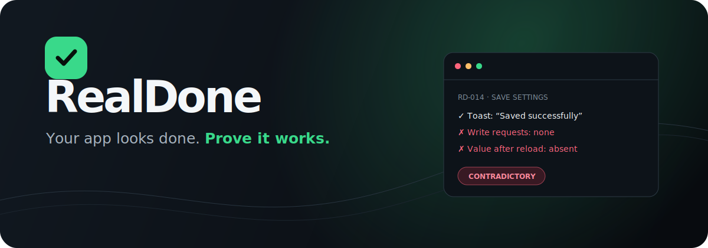
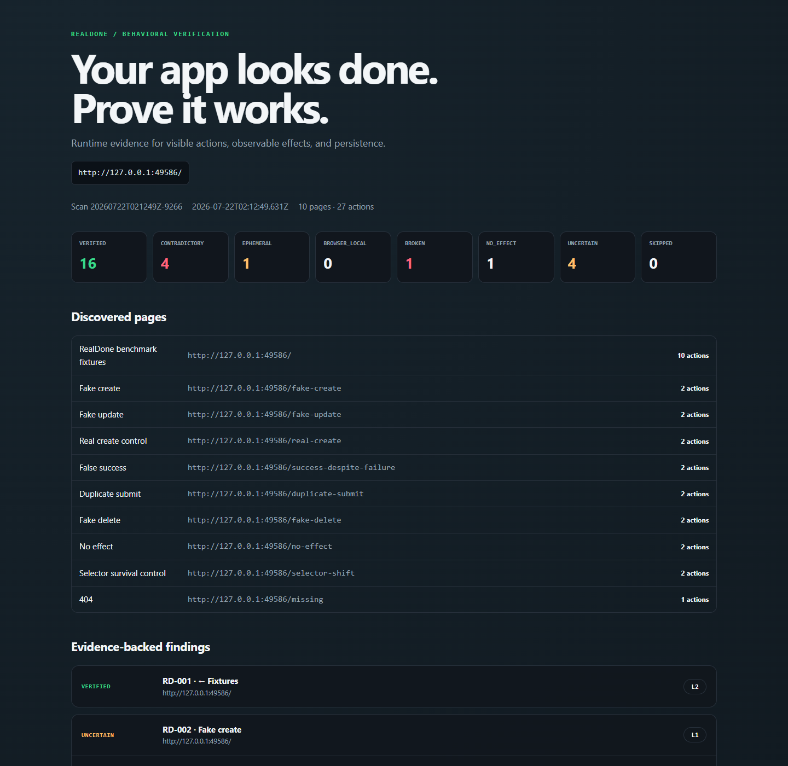

<p align="center">
  
</p>

<p align="center">
  <strong>Runtime behavioral verification for AI-built web applications.</strong><br>
  RealDone clicks the visible action, observes what actually happens, reloads the page, and reports evidence — not vibes.
</p>

<p align="center">
  <a href="https://github.com/datzle123/RealDone/actions/workflows/ci.yml"></a>
  <a href="LICENSE"></a>
  <a href="https://nodejs.org"></a>
</p>

---

AI coding agents are very good at making a feature *look* finished: the button clicks, a spinner appears, a success toast fires, and a new row shows up. None of those things prove the feature exists beyond the current browser state.

RealDone runs your application in Chromium and builds an evidence chain:

```text
Visible action
→ Real browser execution
→ Network / console / DOM / storage evidence
→ Reload and read-back
→ Evidence-backed verdict
→ Reproducible finding
```

## Five-minute start

```bash
git clone https://github.com/datzle123/RealDone.git
cd RealDone
corepack enable
pnpm install
pnpm exec playwright install chromium
pnpm build

node dist/cli.js scan http://localhost:3000
```

Or point RealDone at an installed Chrome/Chromium:

```bash
node dist/cli.js scan http://localhost:3000 --browser-path "/path/to/chrome"
```

The result is written locally to `.realdone/reports/<scan-id>/report.html` plus machine-readable JSON and one replay contract per finding.

<p align="center"></p>

## What a finding looks like

```text
RD-014 · Save settings

00.00s  Opened /settings
00.82s  Filled display name: RD_TEST_8F21C4
01.03s  UI success: Saved successfully
01.03s  Write requests observed: none
02.11s  Reloaded; canary present: false

Verdict: CONTRADICTORY
Detector: RD301 — Success before proof

Reason:
The interface reported success without an observed write request.

Replay:
realdone replay RD-014 --report-dir .realdone/reports/<scan-id>
```

## Verdicts

| Verdict | Meaning |
| --- | --- |
| `VERIFIED` | Observed evidence supports the action at the reported evidence level. |
| `CONTRADICTORY` | The UI claimed success while runtime evidence disagreed. |
| `EPHEMERAL` | The result existed in the current DOM/runtime and disappeared after reload. |
| `BROWSER_LOCAL` | Persistence is limited to one browser context. |
| `BROKEN` | A request, page, console, navigation, or execution error occurred. |
| `NO_EFFECT` | No DOM, URL, network, storage, dialog, or download effect was observed. |
| `UNCERTAIN` | Something happened, but the available evidence cannot prove the intended behavior. |
| `SKIPPED` | Safety policy, credentials, scan budget, or unsupported input prevented execution. |

## Phase 1 detectors

- `RD001` broken action
- `RD002` no observable effect
- `RD003` duplicate submission
- `RD101` refresh disappearance
- `RD201` fake create
- `RD202` fake update
- `RD203` fake delete
- `RD301` success before proof
- `RD302` success despite failure
- `RD303` silent failure

RealDone deliberately prefers a small number of reproducible findings over a large number of guesses.

## CLI

```text
realdone scan <url>
  --max-pages <n>          discovery budget (default 8)
  --max-actions <n>        execution budget (default 24)
  --storage-state <file>   authenticated Playwright state
  --headed                 show Chromium
  --allow-host <hostname>  allow mutation on explicit staging
  --allow-destructive      opt in to destructive actions
  --allow-external         opt in to external effects
  --browser-path <file>    existing Chrome/Chromium executable
  --policy <file>          rules, overrides, hosts, and budgets
  --max-duration <ms>      global time budget
  --retries <n>            transient navigation/locator retries

realdone replay <finding-id> [--report-dir <scan-directory>]
realdone cleanup --report-dir <scan-directory> [--confirm]
realdone benchmark <url> --expected <expectations.json> [--verify-replays]
realdone record <url> --name "Create customer"
realdone verify .realdone/flows/create-customer.json
realdone verify .realdone/flows/create-customer.json --postgres-config .realdone/postgres.json
realdone baseline .realdone/flows --out .realdone/baseline.json
realdone ci --baseline .realdone/baseline.json --contracts .realdone/flows
realdone export-playwright <contract.json> --out tests/flow.spec.ts
```

## Safe by default

Full verification is enabled automatically only for `localhost`, `127.0.0.1`, `.test`, and `.local`. Other hosts are discovery-only unless explicitly allowlisted. Payment, email, SMS, invite, upload/export, refund, account deletion, and similar effects are blocked unless the matching opt-in flag is supplied.

Reports never store authorization headers, cookie values, password values, tokens, API keys, or database URLs. Storage is represented by key names and short hashes.

## Architecture

```mermaid
flowchart LR
  CLI["CLI"] --> Runtime["Chromium runtime"]
  Runtime --> Discovery["Route + action discovery"]
  Discovery --> Policy["Safety policy"]
  Policy --> Executor["Safe action executor"]
  Executor --> Evidence["Evidence collector"]
  Evidence --> Persistence["Reload + read-back"]
  Persistence --> Detectors["Detector engine"]
  Detectors --> Reports["HTML + JSON + replay"]
```



The core is deterministic and has no AI, database, cloud, framework, or coding-agent dependency. See [Architecture](docs/ARCHITECTURE.md) for contracts and extension points.

## Reliability controls

Actions are replayed through weighted semantic fingerprints: test ID, accessible role/name, stable ID, href, visible text, CSS path, and ordinal fallback. Every attempt records match count, visible count, weight, timing, selected strategy, and bounded retries.

Use a checked-in policy when a project needs explicit classification or budget controls:

```bash
node dist/cli.js scan http://localhost:3000 --policy examples/realdone.policy.json
```

Mutations that expose a resource ID or `Location` header are added to `cleanup-ledger.json`. Cleanup is a dry run unless `--confirm` is supplied, accepts `404` as already-cleaned, and reuses optional Playwright auth state without copying secrets into the ledger.

## Record once, verify deterministically

For multi-step or authenticated flows, teach RealDone once:

```bash
realdone record http://localhost:3000 --name "Create invoice" \
  --save-auth .realdone/auth/admin.json

realdone verify .realdone/flows/create-invoice.json
```

The recorder captures compact interaction steps with semantic locators and inferred request/status/text expectations. rrweb is used only as masked local session evidence; deterministic verification uses the RealDone behavior contract, not rrweb replay. Password-like inputs become environment-variable references and auth state stays under the ignored `.realdone/` directory by default.

See [Behavior contracts](docs/CONTRACTS.md) for editing assertions, secret handling, and safety flags.

## Baseline and CI

`baseline` records a green compact outcome for each contract. `ci` re-verifies all or only affected flows and fails when a behavior that previously passed now fails or disappears. Contract changes that still pass are reported separately from regressions.

```yaml
- uses: actions/checkout@v6
- uses: datzle123/RealDone@v0.5.0
  with:
    baseline: .realdone/baseline.json
    contracts: .realdone/flows
```

RealDone writes a concise contract table to GitHub Step Summary. See [Baseline and CI](docs/CI.md) for changed-file selection, source scopes, and Playwright export.

## PostgreSQL source-of-truth evidence

Recorded contracts can add an optional `source` assertion that confirms a canary directly in PostgreSQL. Verification uses a read-only transaction, parameterized values, allowlisted identifiers, bounded timeouts, environment-only credentials, and explicit TLS policy. A passing source assertion is reported as Level 6 evidence.

Database cleanup is recorded in the same local ledger but requires separate CLI and config confirmation plus an allowlisted key. See [PostgreSQL source verification](docs/POSTGRESQL.md).

## Public benchmark fixtures

The repository includes intentionally broken and correct controls for fake create, real persistence, false success, duplicate submission, fake deletion, no-effect actions, and broken navigation.

```bash
pnpm fixture
# In another terminal:
node dist/cli.js scan http://127.0.0.1:<printed-port> --allow-destructive
```

Run the full browser smoke test with `pnpm smoke`. It also verifies selector survival, a bounded replay sample, and cleanup. The standalone `benchmark` command writes precision/recall/FPR and operational metrics to `benchmark.json`.

## Roadmap

- ✅ **v0.1 Core proof** — scanner, evidence, persistence, report, replay, public fixtures.
- ✅ **v0.2 Reliability** — semantic fingerprints, cleanup ledger, retry/policy/budget, precision/recall harness.
- ✅ **v0.3 Flow recorder** — recorded flows, behavior contracts, auth state, deterministic replay.
- ✅ **v0.4 Baseline + CI** — behavior diff, regression gate, GitHub Action, Playwright export.
- ✅ **v0.5 PostgreSQL adapter** — source-of-truth verification and transaction-aware cleanup.
- **v0.6 Agent verification** — Codex/Claude adapters, affected-flow selection, fix prompts.
- **v1.0 Advanced verification** — multi-role, providers, multi-browser, plugin SDK, hardening.

Every phase has a test gate and its own release tag. Detailed acceptance criteria live in [the roadmap](docs/ROADMAP.md).

## Contributing

Start with the benchmark fixtures. A detector change should include a broken case, a correct control, an expected finding, and a false-positive guard. Read [CONTRIBUTING.md](CONTRIBUTING.md) and [SECURITY.md](SECURITY.md) before opening a pull request.

## License

MIT. Third-party components and their licenses are listed in [THIRD_PARTY_NOTICES.md](THIRD_PARTY_NOTICES.md).
